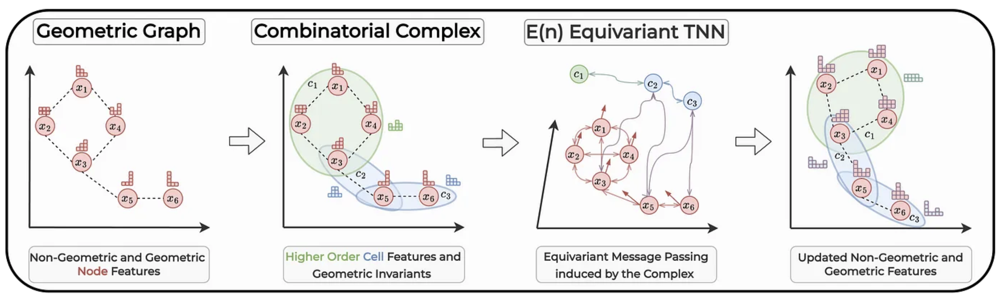
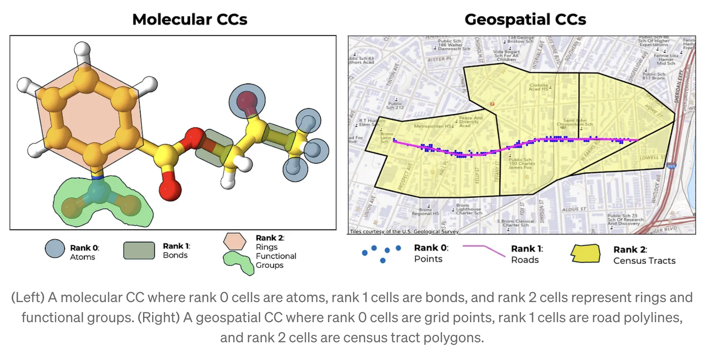

# E(n) Equivariant Topological Neural Network

Code for *Claudio Battiloro, Ege Karaismailoğlu, Mauricio Tec, George Dasoulas, Michelle Audirac, and Francesca Dominici* "E(n) Equivariant Topological Neural Networks"
https://arxiv.org/abs/2405.15429



**Abstract** Graph neural networks excel at modeling pairwise interactions, but they cannot flexibly accommodate higher-order interactions and features. Topological deep learning (TDL) has emerged recently as a promising tool for addressing this issue. TDL enables the principled modeling of arbitrary multi-way, hierarchical higher-order interactions by operating on combinatorial topological spaces, such as simplicial or cell complexes, instead of graphs. However, little is known about how to leverage geometric features such as positions and velocities for TDL. This paper introduces E(n)-Equivariant Topological Neural Networks (ETNNs), which are E(n)-equivariant message-passing networks operating on combinatorial complexes, formal objects unifying graphs, hypergraphs, simplicial, path, and cell complexes. ETNNs incorporate geometric node features while respecting rotation and translation equivariance. Moreover, ETNNs are natively ready for settings with heterogeneous interactions. We provide a theoretical analysis to show the improved expressiveness of ETNNs over architectures for geometric graphs. We also show how several E(n) equivariant variants of TDL models can be directly derived from our framework. The broad applicability of ETNNs is demonstrated through two tasks of vastly different nature: i) molecular property prediction on the QM9 benchmark and ii) land-use regression for hyper-local estimation of air pollution with multi-resolution irregular geospatial data. The experiment results indicate that ETNNs are an effective tool for learning from diverse types of richly structured data, highlighting the benefits of principled geometric inductive bias.

## Setup instructions
```
git clone <repo>
cd topological-equivariant-networks
conda env create -f environment.yaml
```

If you are running the code from a Mac use `conda env create -f environment-macos.yaml`

This will create and activate a new conda environment called "etnn" that contains all the packages necessary to run the code in this repository.

## Real-World Combinatorial Complexes

To showcase the modeling power of CCs and their versatility in conjunction with ETNNs, we introduced two Real-World Combinatorial Complexes useful to model molecules and irregular multi-resolution geospatial data:

**Molecular CC (QM9)** In a Molecular CC, the set of nodes is the set of atoms, while the set of cells and the rank function are such that: atoms are rank 0 cells, bonds and functional groups made of two atoms are rank 1 cells, and rings and functional groups made of more than two atoms are rank 2 cells. A Molecular CC can jointly retain all the properties of graphs, cell complexes, and hypergraphs, thus overcoming their mutual limitations. 

**Geopatial CC** In a Spatial CC, the set of cells is defined by hierarchical spatial objects. Two major examples are geometric descriptions (e.g. points, polylines, and polygons) or political partitions (e.g. zipcodes, counties, states) of a region. In the latter case, the listed objects can be modeled as cells of a CC and their rank correspond to their intrinsic dimensionality. Therefore, rank 0 cells are points, e.g. where air quality monitoring units are located, rank 1 cells are polylines, e.g. traffic roads, and rank 2 cells are polygons, e.g. census tracts.




## Configuration system

The code uses the [Hydra](https://hydra.cc/) configuration system.  Each CC (Molecular and Geopatial) has its own configuration directory. The configs are in the `conf/<cc_name>/` directory. Both config directories have a similar structure (and will be merged in the future). 

## Training

To train a model, you can use the following command:

```bash
python main_qm9.py experiment=<...>
```
for the Molecular CC task and
```bash
python main_geospatial.py experiment=<...>
```
for the Geospatial CC task

The experiments are in the `conf/<cc_name>/<experiment>`. Each experiment consists of a configuration for the dataset, model, and learning parameters. All parameters of the config can be overridden from the command line. For example, to train a model with a different learning rate. See the Hydra documentation for more details.


## Pre-save datasets for faster loading during training

The scripts [create_qm9.py](create_qm9.py) and [create_geospatial.py](create_geospatial.py) use the `InMemoryDataset` [pytorch-geometric](https://pytorch-geometric.readthedocs.io/en/latest/modules/data.html#torch_geometric.data.InMemoryDataset) class to create and save the combinatorial complex as a `.pt` file. To save a dataset, use the commands.

```bash
python create_qm9.py dataset=<dataset_name>
python create_geospatial.py dataset=<dataset_name>
```
where the dataset must be one of the datasets listed in the `conf/<cc_name>/datasets/` directory. This will save the dataset in the `data/<cc_name>_<dataset_name>` directory. This dataset is also cached when training a model. However, pre-caching is useful when running multiple experiments on the same dataset. In particular, lifting the QM9 dataset to a Molecular CC can take about 30 minutes. 

